# Portfolio & Blog CMS

Next.js 16 기반 개인 포트폴리오 & 블로그 CMS.
프로젝트 갤러리 · 마크다운 블로그 · 방명록 · 관리자 대시보드 · AI 자동 포스팅까지 포함한 풀스택 웹 애플리케이션.

**Live** · https://semincode.com

---

## Preview

### 홈 — Three.js 파티클 구체 + 인터랙션

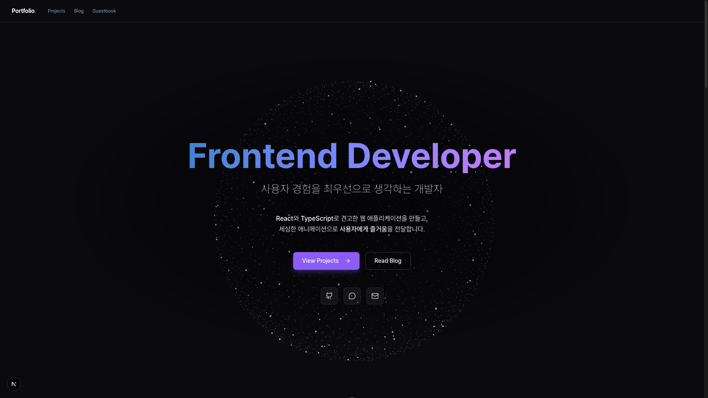

마우스 반발력 물리 연산이 적용된 4000개 파티클 구체. 밀려난 파티클만 보라색으로 색상이 바뀌는 셰이더 어트리뷰트 활용.

### 프로젝트 갤러리

| 그리드 (hover 시 정보) | 상세 모달 |
|:---:|:---:|
| 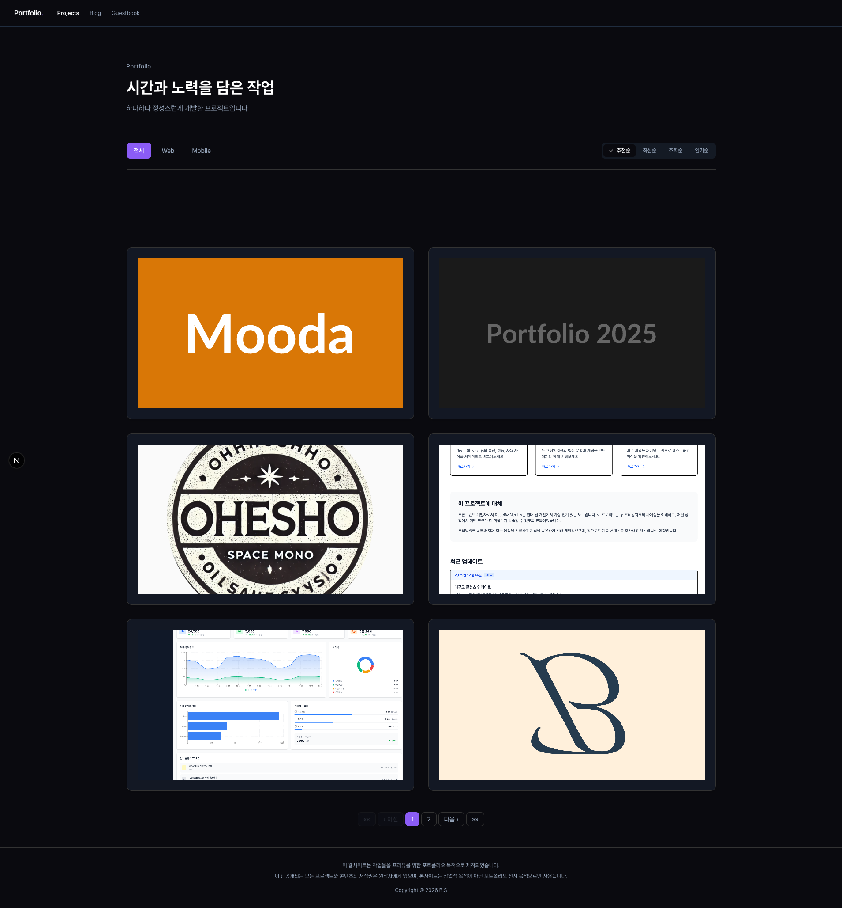 | 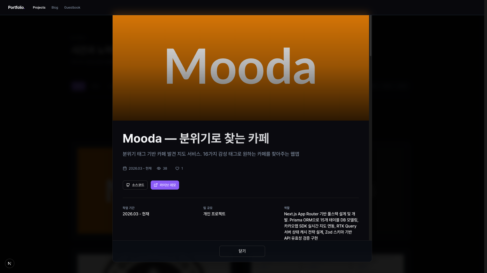 |

- 카드 hover → 그라디언트 오버레이 + 제목 슬라이드 인
- 카드 클릭 → 상세 모달 (이미지 + 메타 + 작업 정보 + 라이브/소스 링크)
- 정렬: 추천순 / 최신순 / 조회순 / 인기순
- 카테고리 필터 (Web / Mobile)

### 블로그

| 목록 (사이드바 + 행 리스트) | 상세 (TOC + 마크다운) |
|:---:|:---:|
| 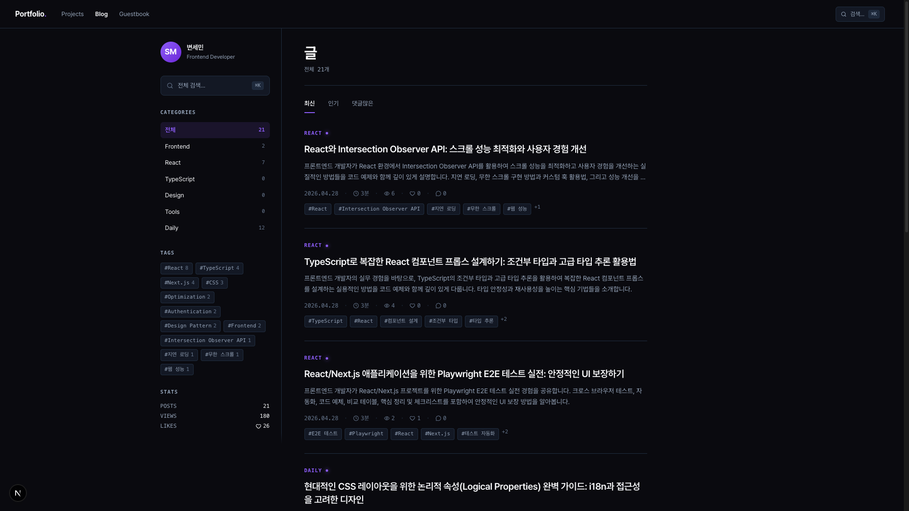 | 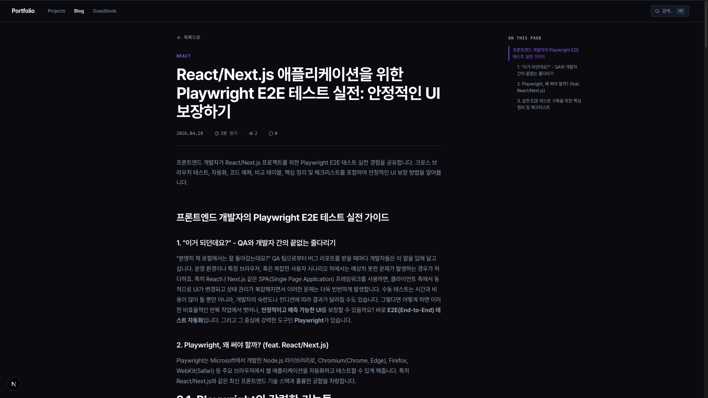 |

- 좌측 280px 사이드바: 프로필 / ⌘K 검색 / Categories(6개) / Tags / Stats — sticky 고정 + 하단 fade mask
- 행(row) 리스트: 카테고리 라벨(uppercase, accent) → 제목 → 발췌(2줄) → 메타(mono) → 태그칩
- 정렬 탭: 최신 / 인기 / 댓글많은 — URL `?sort=` 동기화
- 상세: 단일 720px 컬럼 + 우측 sticky TOC (xl 이상) + 상단 진행률 바 (`scrollY` 기반)
- 마크다운 톤: 코드블록 syntax highlight (purple/green/orange/blue/red) + blockquote accent border + inline code 토큰

### ⌘K 검색

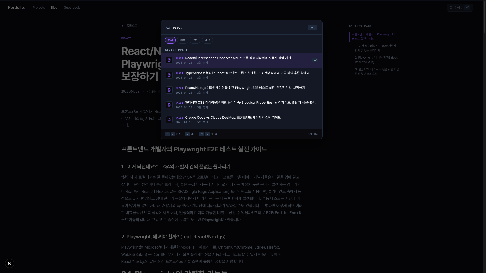

- 글로벌 단축키 ⌘K / Ctrl+K (블로그 라우트에서만 활성)
- Lazy fetch — 첫 open 시점에만 데이터 페치, 이후 RTK Query 캐시 hit
- Scope 칩: 전체 / 제목 / 본문 / 태그 — 매칭 hit count badge
- 그룹: Posts / Categories / Tags — `<mark>` 매칭 하이라이트
- 키보드: ↑↓ 이동 / ↵ 열기 / ⌘↵ 새 탭 / esc 닫기

### 게스트북

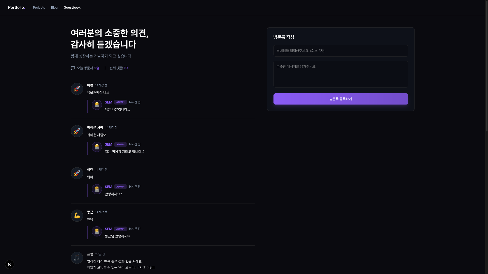

- 익명 작성 (이름 + 메시지)
- 비속어 필터링
- 관리자 답글 + ADMIN 배지
- localStorage 기반 본인 글 식별

---

## 모바일 (< 768px)

| 블로그 + CategoryChips | 햄버거 drawer | 풀스크린 검색 | 상세 + TOC accordion |
|:---:|:---:|:---:|:---:|
| 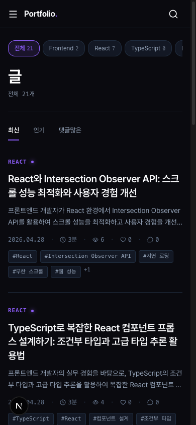 | 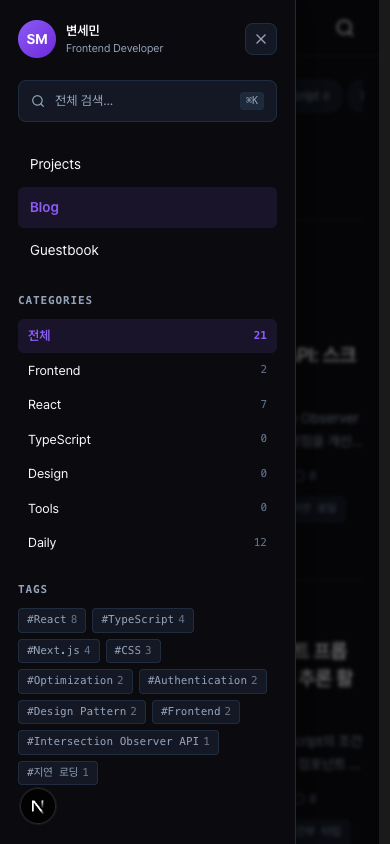 | 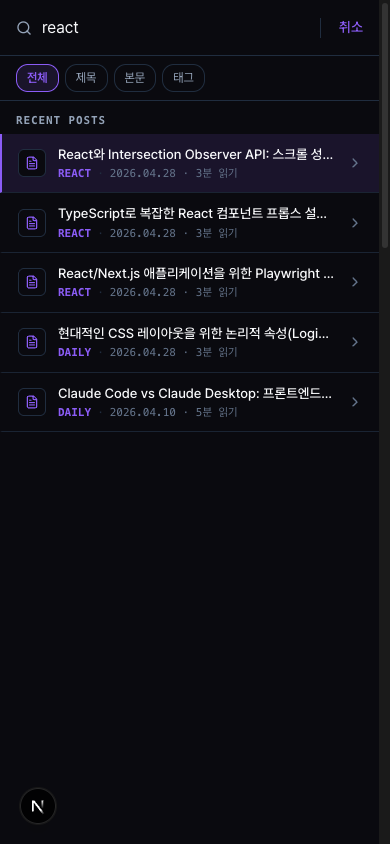 | 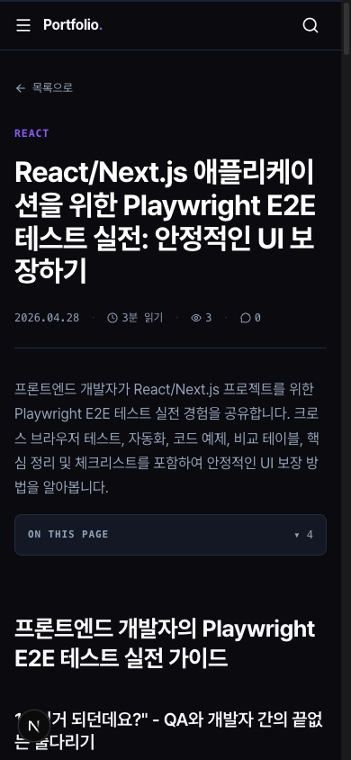 |

- 헤더 56px sticky + blur backdrop
- 햄버거 → 좌측 슬라이드 drawer 240ms (BlogSidebar 콘텐츠 통째 + 메인 nav 통합)
- 비-블로그 라우트: Categories/Tags collapsed `<details>` (lazy fetch)
- 검색은 모달이 아닌 **풀스크린 페이지** — iOS 키보드(~291px) 가림 방지
  - autoFocus + `history.pushState`로 안드로이드 back / iOS swipe-back 닫힘
  - 결과 클릭 시 `input.blur()`로 키보드 dismiss
- 상세: floating TOC 대신 `<details>` accordion (본문 위)

---

## Admin

### 대시보드

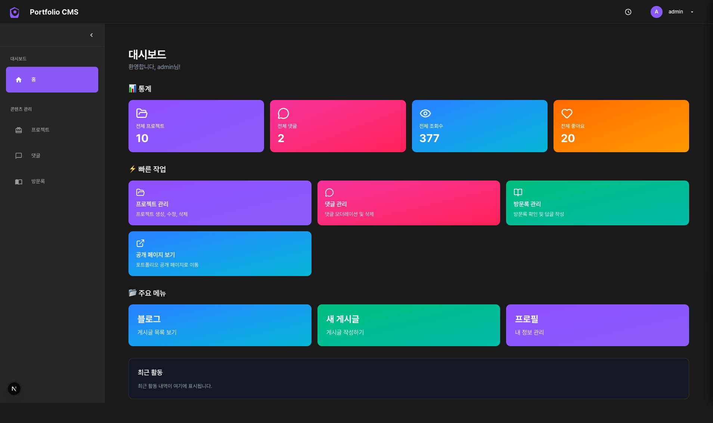

- 통계 카드: 전체 프로젝트 / 댓글 / 조회수 / 좋아요
- 빠른 작업: 프로젝트·댓글·방문록 관리 / 공개 페이지 보기
- 주요 메뉴: 블로그 / 새 게시글 / 프로필

### 블로그 관리 + 미니멀 액션

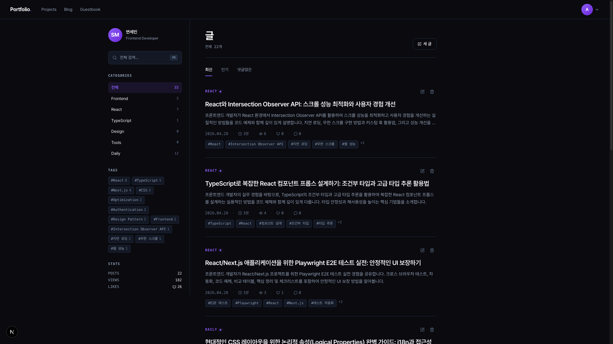

- 카드 우측 상단에 작은 `Edit` / `Trash` 아이콘 항상 노출 (호버 X)
- 평상시 `--blog-fg-subtle` → 호버 시 각각 `accent` / `heart` 컬러
- 비-published 글은 status 배지 (초안/보관)
- 새 글 작성 버튼 노출

### 댓글 관리

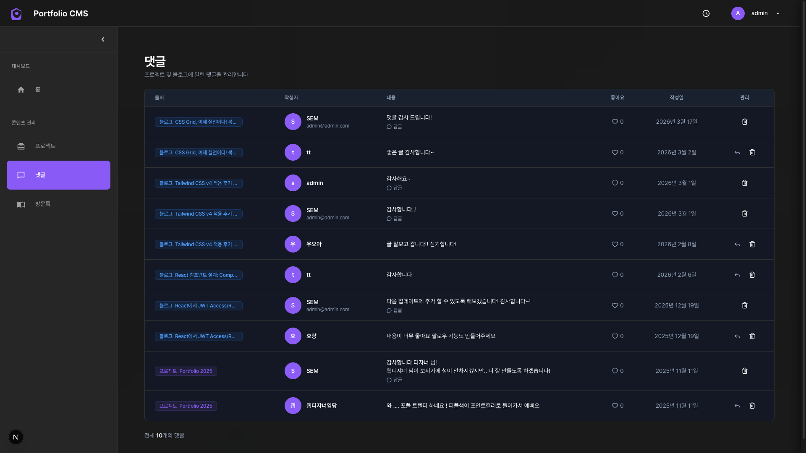

- 출처(블로그/프로젝트) 링크 + 작성자 + 내용 + 좋아요 + 작성일
- 답글 / 삭제 액션

### 방명록 관리

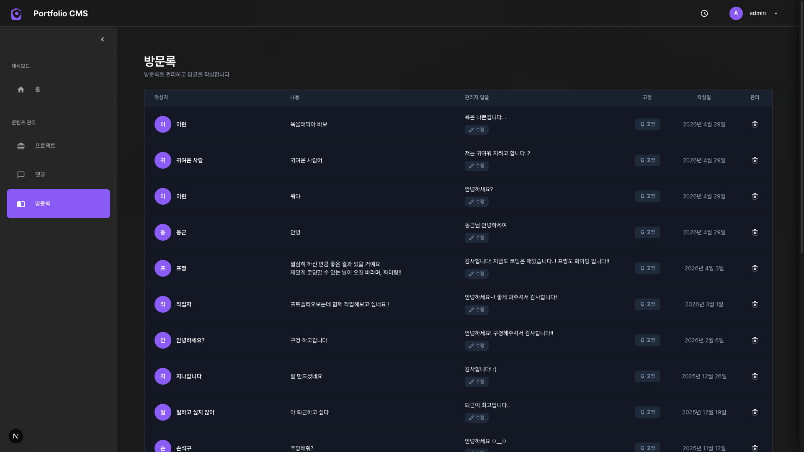

- 인라인 답글 작성/수정
- 고정 토글
- 삭제

### 에디터 — 3-pane 분할 미리보기

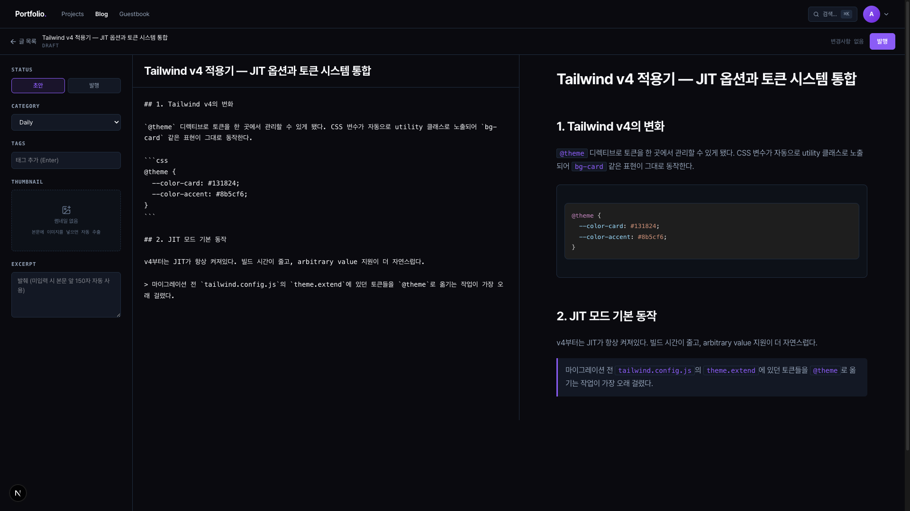

데스크톱(`lg+`) 3-pane / 모바일 탭 분기.

- **좌 (280px)**: Status / Category(6개 select) / Tags(chip + 자동완성, 최대 8개) / Thumbnail(자동 추출 16:9) / Excerpt
- **중앙**: Title input + Markdown textarea (Tab indent 2-space)
- **우**: 실시간 Preview — 실제 글과 동일한 `.blog-article` 스타일로 렌더 (코드 syntax + blockquote + inline code)
- **상단 toolbar**: 글 목록 / 제목 + status / 자동저장 라벨 4-state (idle/pending/saved/error) / 발행 버튼
- 자동저장: 1500ms debounce, edit 모드만 활성. `published_at`은 첫 발행 시점만 set (수정 시 보존)

### 로그인

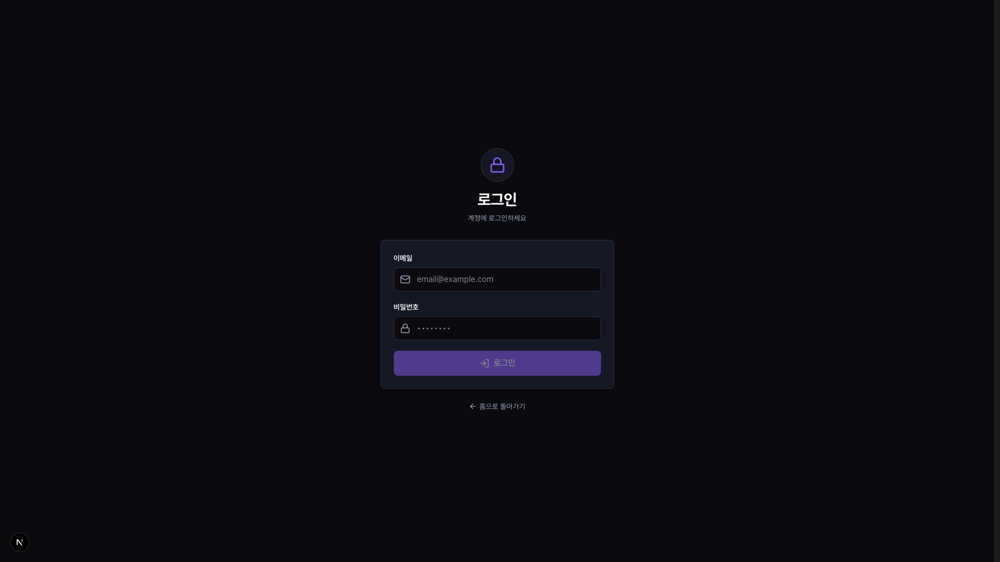

- HttpOnly 쿠키 기반 (XSS 차단)
- 일반 사용자에게는 진입점 노출 X (1인 운영 모델, 댓글/좋아요는 익명)

---

## Tech Stack

| Category | Technology |
|---|---|
| Framework | Next.js 16 (App Router) + Turbopack |
| Language | TypeScript |
| State | Redux Toolkit + RTK Query |
| Database | Supabase (PostgreSQL) |
| Styling | Tailwind CSS v4 (`@theme` 토큰) + CSS variables |
| Animation | Framer Motion + GSAP |
| 3D | Three.js + React Three Fiber + postprocessing (Bloom) |
| Markdown | react-markdown + remark-gfm + rehype-raw |
| Auth | HttpOnly Cookie (Supabase Auth) |
| 자동 포스팅 | Supabase Edge Functions (Deno) + Gemini API |
| RSS | App Router `app/feed.xml/route.ts` (revalidate 1h) |

---

## Features

### Portfolio
- 프로젝트 갤러리 (그리드 + hover 오버레이)
- 상세 모달 (이미지 + 작업기간/팀규모/역할)
- 라이브 데모 / 소스 코드 링크
- 좋아요 & 조회수 트래킹
- 드래그 앤 드롭 순서 변경 (Admin)

### Blog
- 마크다운 기반 3-pane 에디터 + 자동저장
- 6개 고정 카테고리 (`frontend`/`react`/`typescript`/`design`/`tools`/`daily`)
- 태그 chip input + 자동완성 (최대 8개)
- 게시글 번호 기반 URL (`/blog/1`, `/blog/2`)
- 댓글 (대댓글 + 관리자 배지)
- 좋아요 (IP hash dedupe)
- 자동 OG 이미지 추출 (본문 첫 이미지)
- floating TOC (xl) / inline TOC accordion (모바일)
- Reading Progress Bar (article ref 기반)
- Related Posts (카테고리 + 태그 교집합 score)
- About author 카드
- ⌘K 글로벌 검색 (lazy fetch + scope 칩)
- RSS 2.0 피드 (`/feed.xml`, 최근 30개)

### AI 자동 포스팅
- `auto-generate-topics` — 미사용 토픽 < 5개일 때 5개 신규 생성
- `auto-blog-post` — 미사용 토픽 1건 가져와 글 생성 + INSERT 발행
- 페르소나: "정확하게 / 정직하게 / 친절하게" 3원칙 (권위/경험 자칭 금지)
- 카테고리 자동 매핑 (BLOG_CATEGORIES 6개 slug 검증)

### Guestbook
- 익명 작성/삭제 (localStorage)
- 비속어 필터링
- 관리자 인라인 답글

### Admin Dashboard
- 프로젝트/블로그/방명록 CRUD
- 통계 (조회수/좋아요/댓글)
- 댓글 관리 (승인/삭제/답글)

---

## Authentication

HttpOnly 쿠키 기반 인증:

```
Client → API Routes → Supabase Auth
                ↓
   HttpOnly Cookie (Access + Refresh Token)
```

- XSS 공격 방어 (JavaScript에서 토큰 접근 불가)
- 새로고침해도 세션 유지
- 자동 토큰 갱신
- 일반 사용자에게 로그인/회원가입 진입점 노출 안 함 (1인 운영, 익명 댓글/좋아요)

---

## Project Structure

```
src/
├── app/                              # Next.js App Router
│   ├── api/                          # API Routes (auth, admin)
│   ├── admin/                        # 관리자 페이지
│   ├── blog/                         # 블로그 페이지
│   │   ├── [id]/
│   │   ├── create/
│   │   └── page.tsx
│   ├── guestbook/
│   ├── projects/
│   ├── feed.xml/route.ts             # RSS 2.0
│   └── layout.tsx
├── components/
│   ├── layout/                       # Header / Footer / MainLayout / PublicHeader / UserMenu
│   ├── ui/                           # button / badge / container / section ...
│   └── modal/
├── config/
│   ├── categories.ts                 # BLOG_CATEGORIES 6개 + slug 검증
│   └── profile.ts                    # 정적 운영자 프로필
├── features/
│   ├── admin/editor/                 # 3-pane 에디터 (EditorPage, MetaPanel, TagInput, ...)
│   ├── posts/components/             # BlogSidebar / PostListItem / CommandPalette / TOC / ...
│   ├── post-comments/                # 블로그 댓글
│   ├── comments/                     # 프로젝트 댓글
│   ├── guestbook/
│   └── portfolio/
├── hooks/                            # useMediaQuery / useDebounce / ...
├── lib/
│   ├── blog.ts                       # readMinutes / extractThumbnail / categories / sort / related
│   └── supabase.ts
├── store/                            # Redux + RTK Query (postsApi, postCommentsApi, ...)
├── styles/
│   ├── variables.css                 # Tailwind v4 @theme 토큰
│   └── blog.css                      # 블로그 전용 토큰 + 마크다운 스타일
└── views/                            # 페이지 뷰 컴포넌트
```

---

## Development

```bash
npm install
npm run dev       # http://localhost:3000
npm run build     # 프로덕션 빌드
npm run start     # 프로덕션 서버
```

### Environment Variables

```env
NEXT_PUBLIC_SUPABASE_URL=
NEXT_PUBLIC_SUPABASE_ANON_KEY=
SUPABASE_SERVICE_ROLE_KEY=
NEXT_PUBLIC_ADMIN_EMAIL=
```

Edge Function용 (Supabase Dashboard에 별도 등록):

```
GEMINI_API_KEY=
```

---

## Deployment

Vercel 자동 배포 (GitHub Push → Build → Deploy).

Edge Functions는 Supabase에 별도 배포:

```bash
supabase functions deploy auto-generate-topics
supabase functions deploy auto-blog-post
```

cron 스케줄러로 주기 호출 (Supabase Cron 또는 외부 서비스).
